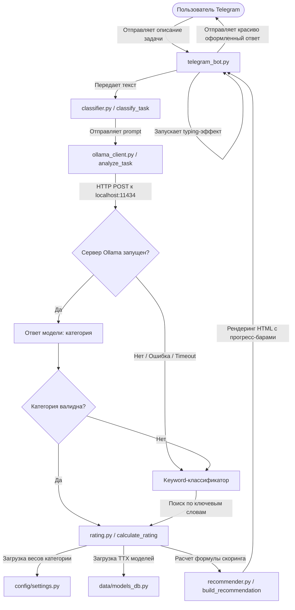

# 🤖 AI Model Advisor System

[](https://www.python.org/)
[](https://core.telegram.org/bots)
[](https://ollama.com/)
[](LICENSE)

Интеллектуальный Telegram-бот, который анализирует описание вашей задачи, автоматически определяет её категорию с помощью локальной LLM и рекомендует наиболее подходящую нейросеть (GPT-4o, Claude 3.5 Sonnet, Gemini 1.5 Pro и др.) на основе актуальных бенчмарков, стоимости и скорости ответа.

---

## 🌟 Основные возможности

*   🧠 **Умная NLP-классификация**: Анализ входящего запроса «на лету» с помощью локальной языковой модели **Ollama** (`llama3.2:1b` или `llama3`).
*   🛡️ **Гибридный Fallback**: Если локальная LLM выключена или не отвечает, система мгновенно и незаметно для пользователя переключится на **высокопроизводительный keyword-классификатор** на базе регулярных выражений.
*   📊 **Динамический многофакторный скоринг**: Расчет рейтинга моделей с помощью настраиваемых весовых коэффициентов для 10 различных категорий задач. Учитываются качественные бенчмарки (HumanEval, MATH, MT-Bench, ARC, BLEU), штраф за стоимость API и бонус за скорость ответа.
*   📱 **Интерактивный интерфейс Telegram**: Красивые HTML-ответы с визуальными шкалами прогресса (`████░░░░░░`), звездными рейтингами (`⭐⭐⭐☆☆`), наградными медалями (`🥇`, `🥈`, `🥉`) и списком альтернатив.
*   ⚙️ **Гибкие настройки**: Конфигурация параметров логирования, уровня логов, токенов доступа и адреса Ollama через файл `.env`.

---

## 🏗️ Архитектура системы

Проект спроектирован по модульному принципу с четким разделением ответственности:

```
├── backend/                  # Бизнес-логика приложения
│   ├── classifier.py         # Модуль классификации (Ollama + Keyword Fallback)
│   ├── ollama_client.py      # HTTP-клиент для взаимодействия с локальным Ollama API
│   ├── rating.py             # Алгоритм расчета рейтинга моделей на основе весов
│   └── recommender.py        # Генератор красивых HTML-рекомендаций для Telegram
├── bot/                      # Слой взаимодействия с пользователем
│   └── telegram_bot.py       # Инициализация и обработчики сообщений Telegram-бота
├── config/                   # Конфигурационные файлы
│   └── settings.py           # Веса категорий, параметры логирования и загрузка dotenv
├── data/                     # База данных моделей
│   └── models_db.py          # Характеристики и бенчмарки нейросетей
├── logs/                     # Директория логов (создается автоматически, игнорируется git)
├── main.py                   # Точка входа в приложение
├── requirements.txt          # Зависимости проекта
├── .env.example              # Пример файла конфигурации переменных окружения
├── .gitignore                # Файл исключений системы контроля версий
└── LICENSE                   # MIT Лицензия
```

---

## 🔄 Схема работы (Data Flow)

Ниже представлена визуализация пути прохождения запроса от момента отправки сообщения пользователем до получения структурированного ответа:



---

## 📊 Формула ранжирования моделей

Рейтинг модели ($R$) для выбранной категории рассчитывается по следующей формуле:

$$R = \sum_{m \in M} (V_m \cdot W_m) - (C \cdot 1000 \cdot W_{cost}) + \left(\frac{1000 - S}{100} \cdot W_{speed}\right)$$

Где:
*   $M$ — набор качественных метрик (`coding`, `math`, `reasoning`, `text_quality`, `translation`).
*   $V_m$ — оценка модели по метрике $m$ (от 0 до 100).
*   $W_m$ — вес метрики для конкретной категории задачи.
*   $C$ — стоимость модели за 1K токенов в USD.
*   $W_{cost}$ — вес экономичности (штраф за дороговизну).
*   $S$ — скорость ответа модели в миллисекундах.
*   $W_{speed}$ — вес скорости (бонус за быстрый ответ).

---

## 📂 Справочник моделей в базе данных (`data/models_db.py`)

На данный момент в системе предзаписаны параметры следующих передовых ИИ-моделей:

| Модель | Разработчик | Кодинг | Математика | Логика | Текст | Перевод | Мультимодальность | Скорость | Стоимость за 1K |
| :--- | :--- | :---: | :---: | :---: | :---: | :---: | :---: | :---: | :---: |
| **GPT-4o** | OpenAI | 92 | 90 | 95 | 88 | 85 | ✅ Да | 800 мс | $0.0300 |
| **Claude 3.5 Sonnet** | Anthropic | 90 | 88 | 93 | 94 | 90 | ✅ Да | 700 мс | $0.0150 |
| **Gemini 1.5 Pro** | Google | 85 | 87 | 88 | 86 | 82 | ✅ Да | 500 мс | $0.0100 |
| **Llama 3 70B** | Meta | 82 | 80 | 85 | 83 | 78 | ❌ Нет | 400 мс | $0.0010 |
| **Mixtral 8x22B** | Mistral | 80 | 78 | 82 | 84 | 76 | ❌ Нет | 350 мс | $0.0005 |

---

## 🚀 Быстрый старт

### 1. Подготовка окружения
Убедитесь, что у вас установлен Python версии 3.10 или выше.

Клонируйте проект и перейдите в его директорию:
```bash
git clone https://github.com/your-username/ai-model-bot.git
cd ai-model-bot
```

Создайте виртуальное окружение и активируйте его:
*   **Windows**:
    ```bash
    python -m venv venv
    venv\Scripts\activate
    ```
*   **Linux/macOS**:
    ```bash
    python3 -m venv venv
    source venv/bin/activate
    ```

Установите необходимые библиотеки:
```bash
pip install -r requirements.txt
```

### 2. Настройка конфигурации (`.env`)
Создайте файл `.env` на основе примера:
```bash
cp .env.example .env
```
Откройте файл `.env` и укажите ваши настройки:
*   `TELEGRAM_BOT_TOKEN`: Токен вашего бота, полученный от [@BotFather](https://t.me/BotFather) в Telegram.
*   `LLM_PROVIDER`: Оставьте `ollama`.
*   `OLLAMA_BASE_URL`: Адрес вашего локального инстанса Ollama (по умолчанию `http://localhost:11434`).
*   `OLLAMA_MODEL`: Локальная модель, которую вы будете использовать для классификации (рекомендуется компактная `llama3.2:1b` или классическая `llama3`).
*   `LOG_LEVEL`: Уровень логирования (DEBUG, INFO, WARNING, ERROR).

### 3. Установка и запуск Ollama (для работы NLP-классификатора)
1. Скачайте и установите Ollama с [официального сайта](https://ollama.com/).
2. Запустите приложение Ollama.
3. Скачайте модель через терминал:
   ```bash
   ollama pull llama3.2:1b
   ```

### 4. Тестирование работоспособности модулей
Перед запуском бота рекомендуется проверить корректность работы интеграции с Ollama и алгоритма расчёта с помощью готовых тест-скриптов:

*   **Проверка связи с Ollama напрямую**:
    ```bash
    python test_ollama_raw.py
    ```
*   **Комплексный тест бэкенда** (тестирует подключение к Ollama, классификацию тестовой фразы, расчёт рейтинга и сборку итогового сообщения):
    ```bash
    python test_backend.py
    ```

### 5. Запуск бота
После успешного прохождения тестов запустите Telegram-бота:
```bash
python main.py
```

Откройте диалог с вашим ботом в Telegram и отправьте команду `/start`.

---

## 📈 Примеры запросов для проверки

*   `"Напиши функцию на Python для парсинга HTML страниц"` ➔ Определит категорию **Программирование**, порекомендует **GPT-4o** за отличные показатели кодинга.
*   `"Напиши красивый пост в Telegram-канал про пользу сна"` ➔ Определит категорию **Анализ и структурирование текста**, порекомендует **Claude 3.5 Sonnet** благодаря высочайшей оценке качества текста.
*   `"Мне нужно распознать текст со скриншота чека"` ➔ Определит категорию **Мультимодальные задачи**, отфильтрует модели без поддержки зрения и порекомендует **GPT-4o**.
*   `"Реши систему линейных уравнений методом Гаусса"` ➔ Определит категорию **Математические задачи**, выведет детальную метрику математики.
*   `"Сделай микросервис на Go с приоритетом на максимальную скорость ответа и экономию"` ➔ Определит приоритеты **Скорости** или **Низкой стоимости** и предложит ультрабыстрый **Mixtral 8x22B** или бюджетный **Llama 3 70B**.

---

## 📝 Лицензия

Проект распространяется на условиях лицензии [MIT](LICENSE). Вы можете свободно использовать, модифицировать и распространять его даже в коммерческих целях.
